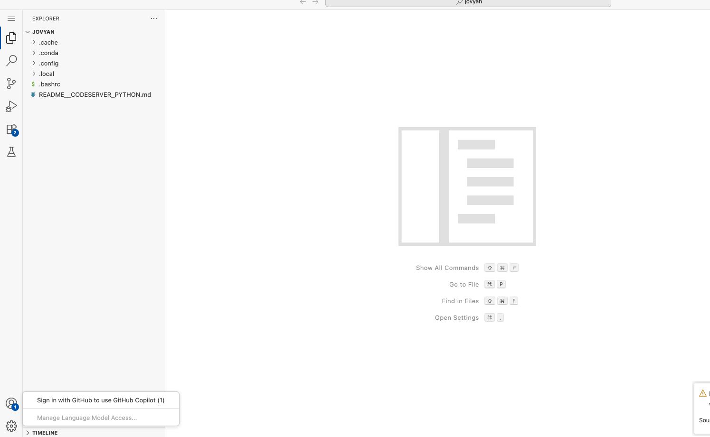
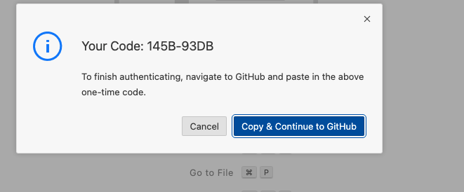
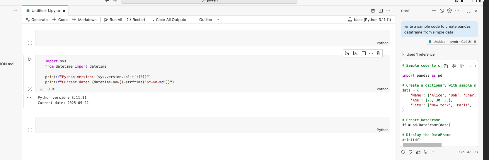
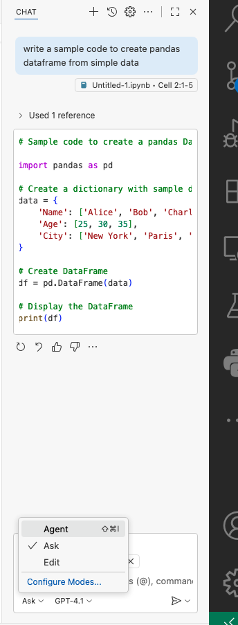

# Enabling GitHub Copilot on Kubeflow Code Server

## Overview
This guide explains how to enable and use GitHub Copilot in your Kubeflow Code Server notebook environment. GitHub Copilot is pre-installed in this environment.

## Prerequisites
- Access to a Kubeflow notebook with Code Server
- A GitHub account with GitHub Copilot subscription

## Steps to Enable GitHub Copilot

### 1. Launch Code Server
Open your Kubeflow notebook server with Code Server interface.


### 2. Sign in to GitHub Copilot
1. Click on the GitHub Copilot icon in the left sidebar of Code Server
2. Click "Sign in to GitHub"
3. Follow the authentication prompts to sign in to your GitHub account
4. Authorize GitHub Copilot to access your account




### 3. Verify Installation
To verify that GitHub Copilot is working:
1. Open a notebook file 
2. you should see a option to generate code





## Features

### Code Suggestions
- Real-time code suggestions as you type

### Chat Interface
- Agent
- Ask questions about code
- Get explanations and suggestions



### DisAdvantages
Code-server cannot directly access the official Visual Studio Code Marketplace due to Microsoft's terms of service. This is a significant drawback because many popular extensions, including some from Microsoft, are only available there. Instead, Code-server relies on the Open VSX Registry, which is a community-driven, open-source alternative. While many extensions are available on Open VSX, not all of them are, and there can be a delay in updates.

## Troubleshooting

If GitHub Copilot is not working:

1. Check extension status:
```sh
code-server --list-extensions | grep github.copilot