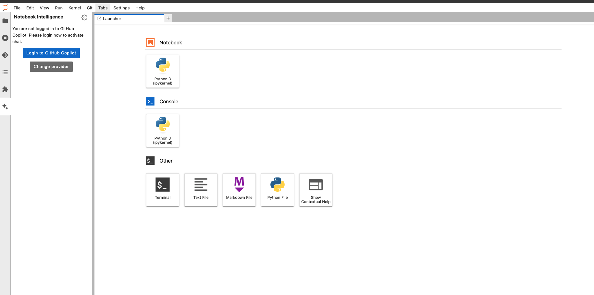
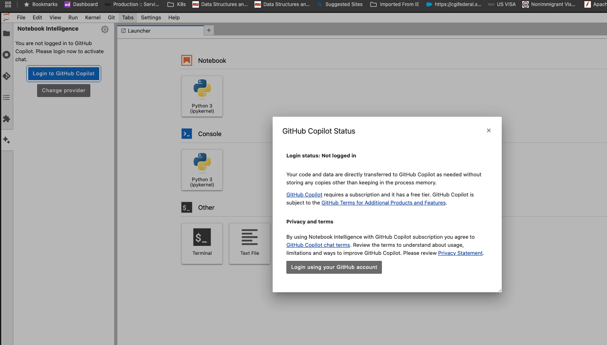
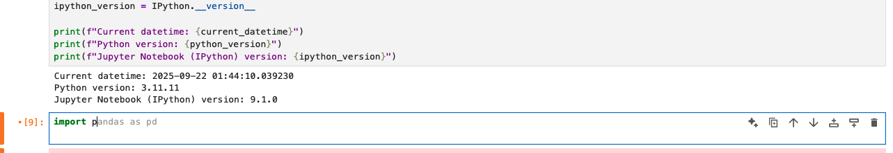
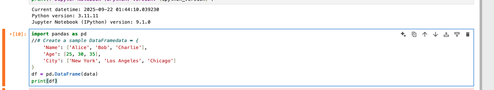
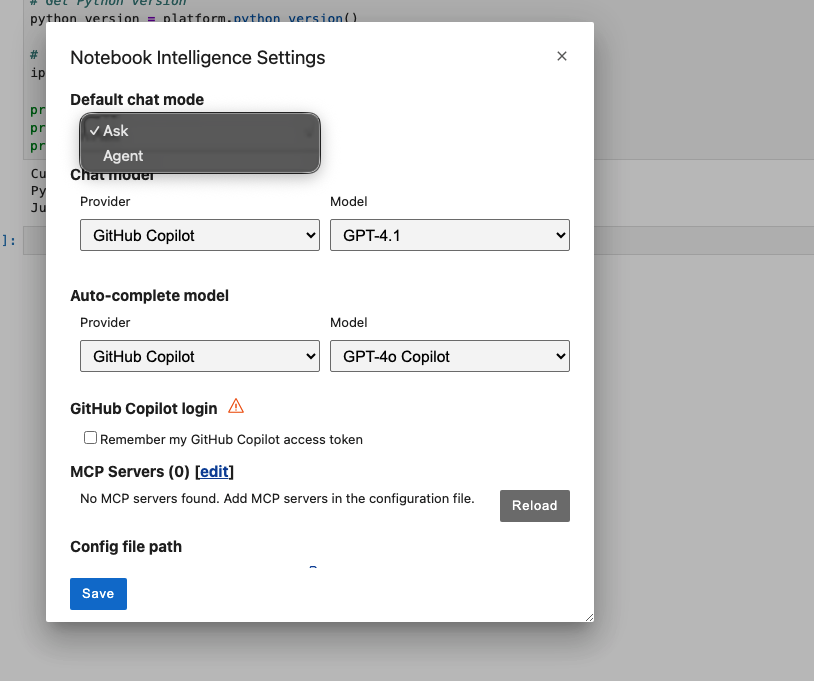

# Using Notebook Intelligence in JupyterLab Kubeflow

## Overview
Notebook Intelligence is a JupyterLab extension that provides AI-powered code assistance and suggestions for notebooks.

## Features

- AI-powered code completions
- Natural language to code conversion
- Documentation generation
- Agent

## Installation
The extension is pre-installed in this JupyterLab environment with version 2.4.2.

## Getting Started

### 1. Open JupyterLab
Navigate to your Kubeflow dashboard and launch JupyterLab.

### 2. Check Extension is enabled

1. Ensure notebook intelligence is enabled

### 3. Login to GHCP

### 4. Using Code Assistance

1. Open or create a new notebook
2. Start typing code
3. AI suggestions will appear automatically
4. Press Tab to accept suggestions

### 5. Natural Language Commands

1. Type "//" followed by your request in natural language
2. Example: "//create a pandas dataframe with sample data"
3. Press Enter to execute

### 6. Configuration

You can customize the extension settings:
1. Go to Settings > Advanced Settings Editor
2. Select "Notebook Intelligence" 
3. Modify available options:
   - Enable/disable autocompletion
   - Adjust suggestion delay
   - Set maximum suggestions
   - Pick model or Agent mode

## Documentation

https://notebook-intelligence.github.io/notebook-intelligence/blog/2025/03/05/support-for-any-llm-provider.html
